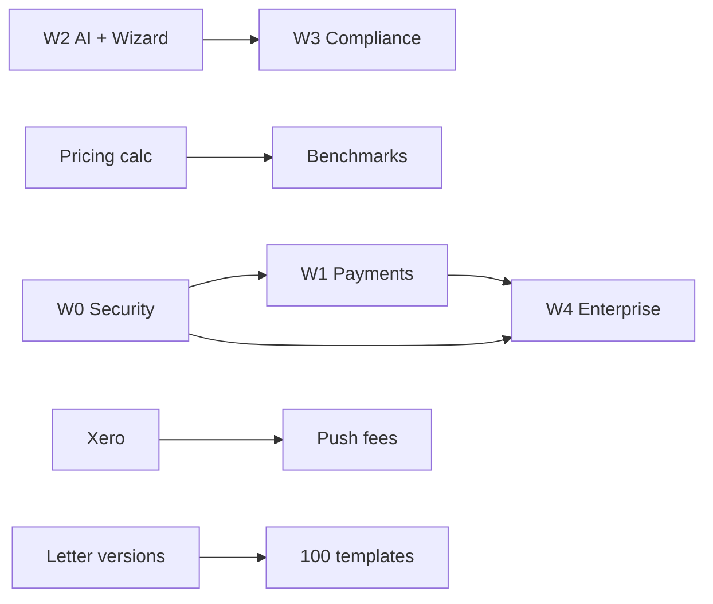

# Engage — Market Leader Phased Plan
<!-- Derived from competitive analysis vs GoProposal, FigsFlow, Ignition, Karbon (2026-07-01) -->
<!-- Strategic wedge: UK proposal + compliance + Clara AI + proposal-to-cash — NOT full practice management -->

## North Star
**Fastest path from Companies House lookup → priced UK proposal → signed engagement → collected fees** — with AI that saves 30+ minutes per proposal without runaway token costs.

## Competitive gaps to close (priority order)
1. Revenue loop stops at "signed" (Ignition/FigsFlow win on mandate → invoice)
2. No live Xero/QBO/GoCardless integrations (catalogue mentions only)
3. AML/compliance productised (stubs vs GoProposal AML / FigsFlow ID checks)
4. Pricing methodology vs catalogue-only (GoProposal core value)
5. Bulk renewals + partner approvals (operational scale)
6. AI sprawl without cost discipline (30+ endpoints, estimated token budget)
7. Commercial maturity (MFA, password reset, SOC2, status page)

---

## Phase W0 — Commercial foundation (weeks 1–2)
**Status:** in_progress (W0.1–W0.2 implemented by security-agent)  
**Goal:** Safe to sell to regulated UK firms

| ID | Deliverable | Status | Owner track |
|----|-------------|--------|-------------|
| W0.1 | MFA / TOTP (replace 501 stubs) | **done** | security-agent |
| W0.2 | Password reset flow | **done** | security-agent |
| W0.3 | Render Starter + persistent disk + custom domain | pending | ops |
| W0.4 | Terms, privacy, AI disclosure pages | pending | legal-ux |
| W0.5 | Stripe trial enforcement end-to-end | pending | billing |
| W0.6 | E2E green on staging | pending | qa |

**Exit criteria:** Partner firm can sign up, reset password, enable 2FA, send proposal on custom domain.

---

## Phase W1 — Proposal-to-cash (weeks 3–6)
**Status:** in_progress  
**Goal:** Match Ignition/FigsFlow on money collection

| ID | Deliverable | Status | Owner track |
|----|-------------|--------|-------------|
| W1.1 | Xero OAuth + client import | **done** (scaffold) | xero-agent |
| W1.2 | Push accepted proposal lines → Xero (contact notes / repeating invoice stub) | **partial** (notes live, invoice stub) | xero-agent |
| W1.3 | GoCardless/Revolut payment at sign (public sign page) | **done** | payments-agent |
| W1.4 | Post-accept confirmation + payment status on proposal | **done** | payments-agent |
| W1.5 | Bulk renewal wizard (filter → template → batch send) | **done** | renewals-agent |
| W1.6 | Partner approval before send (junior drafts → partner approves) | pending | workflow-agent |

**Exit criteria:** Caroline renews 20 clients in one session; client signs and DD mandate captured; client appears in Xero.

---

## Phase W2 — AI efficiency + time-to-value (weeks 4–8, parallel with W1)
**Status:** in_progress  
**Goal:** Clara saves time without token overspend; new tenant sends first proposal in <10 min

| ID | Deliverable | Status | Owner track |
|----|-------------|--------|-------------|
| W2.1 | Disable background auto-fit; user-triggered only | **done** | ai-cost-agent |
| W2.2 | Template-first cover letters; AI only on "Revise" | **done** | ai-cost-agent |
| W2.3 | Clause-picker engagement letters; full AI optional | **done** | ai-cost-agent |
| W2.4 | Cache client-brief 24h per company number | **done** (in-memory) | ai-cost-agent |
| W2.5 | Real token logging in budget check (not calls×2.5k) | **done** | ai-cost-agent |
| W2.6 | Hide stub AI features (benchmark, regulatory watcher) until real | **done** | ai-cost-agent |
| W2.7 | First proposal wizard (Clara-guided 5-step) | **done** | wizard-agent |
| W2.8 | Accept/reject suggestion cards in builder | **done** | wizard-agent |
| W2.9 | Pricing methodology module (turnover/complexity → fee bands) | **done** | pricing-agent |
| W2.10 | Real-time client preview split pane | pending | ux-agent |

**Exit criteria:** AI calls per proposal down 60%; new user completes wizard → sent proposal; pricing calculator suggests fees.

---

## Phase W3 — UK compliance moat (weeks 7–10)
**Status:** pending  
**Goal:** OverSuite-equivalent trust for engagement letters + AML path

| ID | Deliverable | Status | Owner track |
|----|-------------|--------|-------------|
| W3.1 | Engagement library versioning (v2026.1 → notify affected templates) | **done** | compliance-agent |
| W3.2 | 100+ seed templates (ICAEW/ACCA-aligned packages) | pending | content |
| W3.3 | AML partner integration scaffold (SmartSearch/Creditsafe webhook) | pending | aml-agent |
| W3.4 | ID verification flow on client onboarding | pending | aml-agent |
| W3.5 | Regulatory rule engine (MTD thresholds, VAT) — rules not LLM | pending | compliance-agent |
| W3.6 | Win/loss tagging on decline + cohort analytics | **done** | analytics-agent |

**Exit criteria:** Firm admin sees "3 templates need update"; decline reasons appear in analytics; AML check purchasable.

---

## Phase W4 — Scale + enterprise (weeks 11–16)
**Status:** pending  
**Goal:** Defensible moat and enterprise sales

| ID | Deliverable | Status | Owner track |
|----|-------------|--------|-------------|
| W4.1 | Anonymised fee benchmarks across tenants | pending | data-agent |
| W4.2 | HubSpot + Zapier proposal events | pending | integrations-agent |
| W4.3 | Multi-firm workspace (accounting groups) | pending | tenancy-agent |
| W4.4 | Voice of practice (upload sample letters → style) | pending | ai-moat-agent |
| W4.5 | SOC 2 control pack + status page | pending | security-agent |
| W4.6 | G2 case study + ROI calculator on marketing site | pending | growth |
| W4.7 | QuickBooks sync (parity with Xero) | pending | xero-agent |
| W4.8 | Mobile signing polish + Clara FAQ on sign page | pending | ux-agent |

**Exit criteria:** Enterprise pilot with MFA, SLA, benchmarks; 3 published case studies.

---

## Parallel agent tracks (spawned 2026-07-01)

| Agent | Phase items | Project path |
|-------|-------------|--------------|
| ai-cost-agent | W2.1–W2.6 | engage-deploy |
| wizard-agent | W2.7–W2.8 | engage-deploy |
| security-agent | W0.1–W0.2 | engage-deploy |
| compliance-agent | W3.1, W3.5 | engage-deploy |
| renewals-agent | W1.5 | engage-deploy |
| xero-agent | W1.1–W1.2 | engage-deploy |
| pricing-agent | W2.9 | engage-deploy |
| analytics-agent | W3.6 | engage-deploy |
| payments-agent | W1.3–W1.4 | engage-deploy |

---

## Dependencies

---

## Success metrics

| Metric | Baseline | W2 target | W4 target |
|--------|----------|-----------|-----------|
| Time to first sent proposal (new tenant) | ~45 min | <10 min | <5 min |
| AI calls per proposal | ~8–12 | <4 | <3 |
| Proposal → signed conversion | unknown | +15% | +25% |
| Renewal batch (clients/session) | 1 | 20 | 100 |
| Integration attach rate | 0% | 40% Xero | 60% |

---

## What we explicitly will NOT build (avoid Karbon trap)
- Full practice management / email triage
- Time tracking as core product
- General CRM pipeline (HubSpot events only)
- Voice proposal as default path