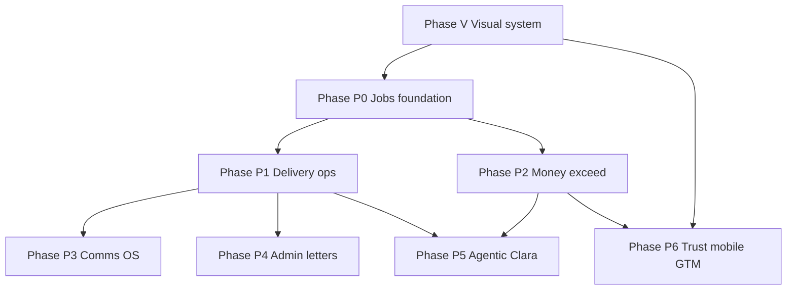

# Engage vs Engager.app — Competitive Analysis & Exceed Plan

**Date:** 2026-08-01  
**Scope:** Full product comparison of Capstone **Engage** (`engage-from-capstone`) against **Engager.app** (TaxCalc-owned practice management).  
**Intent:** Exceed Engager on capability **and** adopt the visual clarity users love — without abandoning Engage’s proposal-to-cash + Clara moat.

**Primary sources:** engager.app product pages, TaxCalc Engager pages, Engage codebase (schema, routes, nav, roadmaps), product screenshots under `docs/competitor-screens/`.

---

## 0. Executive summary

| Dimension                   | Engager.app                                                                                                                                                                         | Engage (today)                                      | Verdict                                                                                                                |
| --------------------------- | ----------------------------------------------------------------------------------------------------------------------------------------------------------------------------------- | --------------------------------------------------- | ---------------------------------------------------------------------------------------------------------------------- |
| **Product category**        | Full **practice management OS**                                                                                                                                                     | **Proposal → engagement → cash** specialist with AI | Different products today                                                                                               |
| **Market position**         | 2,000+ firms; TaxCalc distribution; £9+/mo client-based                                                                                                                             | Capstone portfolio; £49/£99/£249 seat-ish tiers     | Engager wins GTM reach                                                                                                 |
| **Hero UX**                 | Jobs kanban, deadlines, team workload                                                                                                                                               | Proposal builder, Clara, pricing                    | Different heroes                                                                                                       |
| **Visuals**                 | Clean white, color-coded chips, dense boards, soft cards                                                                                                                            | Editorial slate/ink, sidebar, glass remnants        | **User prefers Engager look**                                                                                          |
| **Where Engager wins hard** | Jobs, workflows, time, portal as file hub, email-in-app, bulk ops, mobile apps, integrations breadth                                                                                | —                                                   | Large gap                                                                                                              |
| **Where Engage wins hard**  | Clara AI, Companies House → priced proposal, MTD ITSA intelligence, Stripe Connect proposal-to-cash, engagement library versioning, fee benchmarks path, Capstone Clarity ecosystem | —                                                   | Defend & expand                                                                                                        |
| **Strategic implication**   | —                                                                                                                                                                                   | Prior plan said _do not build full PM_              | **User direction supersedes that:** expand into PM **through** the engagement lifecycle, not as a generic Karbon clone |

**North star (revised):**

> Fastest path from **Companies House → priced UK proposal → signed engagement → collected fees → jobs delivered → renewals** — with **Engager-class operations UI** and **Clara as the practice co-pilot Engager does not have**.

---

## 1. What each product actually is

### 1.1 Engager.app (TaxCalc)

Cloud practice management for UK accountants & bookkeepers. Built by practitioners; now TaxCalc group (investment May 2025; deep TaxCalc integration shipping). Voted Practice Management Software of the Year 2025. Pricing: **per client** from ~£9+VAT/mo, **unlimited users**; add-ons for SMS / Xero sync.

**Core modules (from product + marketing):**

- Letters of Engagement + proposals + catch-up fees
- Value-based **pricing formulas** (custom fields, brackets, service library)
- **Jobs** with **phases**, Kanban / list / cards, statutory deadlines
- **Task management**, checklists, colleague tagging
- **Time tracking** vs budgets → profitability
- **Workflows** + **automated email** (date / stage triggers)
- **Client portal** (files, e-sign, tasks, messaging) + **native mobile apps**
- **Email integration** (M365 / Gmail) — comms linked to clients
- Document designer / branded templates
- Letters of **disengagement**, **professional clearance**, HMRC **64-8**
- **Forms** / bulk forms, bulk messaging
- **Custom fields**, filtering, sales kanban (add-on)
- Integrations: TaxCalc, Xero, QBO, FreeAgent, Companies House, HMRC 64-8, Adfin, Crezco, Armalytix, Xama, RQ, Xenon Connect
- Trust: GDPR, Cyber Essentials, UK hosting

**Visual system (product UI):**

- Light chrome: white / soft grey backgrounds
- **Horizontal top nav** for primary modules (Dashboard, Clients, Jobs, Time logs, Emails, Automations, Invoices)
- Soft rounded cards, light drop shadows, generous radius
- **Status language = color chips** (red overdue, orange, yellow, green on track)
- Job cards: client name, job type, fee, staff initials, % progress, phase CTA
- Dense but scannable kanban columns with monetary totals per column
- Marketing: deep blue wave photography + floating product frames

### 1.2 Engage (Capstone) — current reality

Nav (`frontend/src/config/navigation.ts`): Dashboard · Proposals · Clients · Services · Pricing calculator · Templates · Analytics · Settings.

**Data model** (Prisma): FirmGroup, Tenant, User, Client, Proposal (+ services, signatures, views, documents, payments), ServiceTemplate, EngagementLibraryVersion, ProposalTemplate, CoverLetterTemplate, PricingRule, Touchpoint\*, EmailLog, RegulatorySignal — **no Job / Task / TimeEntry / Workflow models**.

**Shipped strengths:**

| Area                   | Evidence                                                                                  |
| ---------------------- | ----------------------------------------------------------------------------------------- |
| Proposal lifecycle     | Create/edit/wizard, share, public view, e-sign, accept/decline, archive, bulk renewals    |
| UK pricing             | VAT, billing cycles, pricing rules, calculator, contingent fees, UK service catalog       |
| Compliance content     | Engagement clause library + versioning, UK LoE templates, MTD ITSA client fields          |
| AI (Clara)             | Streaming drafts, auto-fit, CH brief, attention queue, voice-of-practice, cost discipline |
| Money                  | Stripe Connect split, Revolut path, platform fee, payout settings                         |
| Integrations (partial) | Companies House, Xero/QBO scaffolds, Adfin route, AML scaffold                            |
| Product UX polish      | Command palette, dark/light, skeletons, MFA, password reset, analytics                    |
| Ecosystem              | Capstone Clarity family, AccountFlow sibling, superadmin                                  |

**Explicit non-goals in prior strategy** (`MARKET_LEADER_PLAN.md`): full PM, time tracking as core, general CRM. **This plan reverses that for Engager parity+**, with sequencing that protects the proposal-cash moat.

---

## 2. Capability matrix

Legend: **E+** Engage ahead · **≈** parity or near · **G+** Engager ahead · **—** neither mature

| Capability                              | Engager                         | Engage                                           | Gap owner                                 |
| --------------------------------------- | ------------------------------- | ------------------------------------------------ | ----------------------------------------- |
| **WIN WORK**                            |                                 |                                                  |                                           |
| Proposal / quote generation             | Strong                          | Strong + Clara                                   | **E+** AI depth                           |
| Letter of engagement                    | Strong branded templates        | Strong + versioned clause library                | **≈ / E+** versioning                     |
| Value-based pricing formulas            | Custom fields + formula builder | Pricing rules + calculator + turnover/complexity | **G+** formula UX; **E+** AI advisor path |
| Catch-up fees                           | First-class                     | Can model as one-off lines                       | **G+**                                    |
| Sales pipeline kanban                   | Add-on                          | Proposal statuses only                           | **G+**                                    |
| Companies House enrich                  | Integration                     | Native CH → brief                                | **E+**                                    |
| MTD ITSA intelligence                   | Mentioned in jobs               | Client status + regulatory signals               | **E+**                                    |
| **SIGN & ONBOARD**                      |                                 |                                                  |                                           |
| E-signature                             | Mature                          | Present; forensics still hardening               | **≈** → need certificate/hash             |
| Client portal (files, tasks, messaging) | Full branded hub + mobile apps  | Proposal-centric portal                          | **G+** large                              |
| Forms / questionnaires                  | Bulk forms                      | AML onboarding page partial                      | **G+**                                    |
| ID / AML checks                         | Via partners (Armalytix etc.)   | `/api/aml` scaffold                              | **G+** until partner live                 |
| Onboarding workflows                    | Job phases + automation         | Touchpoints + acceptance email                   | **G+**                                    |
| **DELIVER WORK**                        |                                 |                                                  |                                           |
| Jobs + job phases                       | Core product                    | **Missing**                                      | **G+ critical**                           |
| Kanban task boards                      | Core                            | **Missing**                                      | **G+ critical**                           |
| Statutory deadlines                     | Core                            | Partial via MTD dates                            | **G+**                                    |
| Checklists                              | Yes                             | No                                               | **G+**                                    |
| Time tracking vs budget                 | Yes                             | No                                               | **G+**                                    |
| Workload balancing                      | Filters by staff                | No                                               | **G+**                                    |
| Colleague tagging                       | Yes                             | No                                               | **G+**                                    |
| **COMMUNICATE**                         |                                 |                                                  |                                           |
| Automated email by date/stage           | Mature library                  | Touchpoint engine + jobs                         | **G+** maturity                           |
| Email inbox integration (M365/Gmail)    | Two-way client-linked           | OAuth send for proposals                         | **G+**                                    |
| Bulk messaging / SMS                    | Yes (+ SMS add-on)              | No                                               | **G+**                                    |
| **MONEY**                               |                                 |                                                  |                                           |
| Invoicing inside product                | Yes (nav: Invoices)             | Via Stripe Connect / Xero push                   | **Different model**                       |
| Recurring client billing                | Practice ops                    | **Engage moat target** (R1)                      | **E+** if finished                        |
| Payment collection at sign              | Via Adfin/Crezco partners       | Stripe Connect + platform fee                    | **E+** if polished                        |
| Fee profitability from time             | Yes                             | No                                               | **G+**                                    |
| **DOCUMENTS & ADMIN**                   |                                 |                                                  |                                           |
| Document designer                       | Yes                             | PDF/HTML templates                               | **G+** designer                           |
| Disengagement / clearance letters       | First-class                     | No                                               | **G+**                                    |
| HMRC 64-8                               | Integration                     | No                                               | **G+**                                    |
| Custom fields                           | Extensive                       | Limited client fields                            | **G+**                                    |
| **AI & INTELLIGENCE**                   |                                 |                                                  |                                           |
| Generative AI co-pilot                  | Not a product pillar            | Clara (core)                                     | **E+ decisive**                           |
| Regulatory proactive alerts             | Limited                         | Regulatory signals path                          | **E+**                                    |
| Cross-tenant fee benchmarks             | No                              | Designed (R3)                                    | **E+**                                    |
| **PLATFORM**                            |                                 |                                                  |                                           |
| Unlimited users                         | Yes (pricing model)             | Tiered users                                     | Commercial choice                         |
| Mobile apps (staff + client)            | App Store / Play                | Capacitor iOS scaffold                           | **G+**                                    |
| TaxCalc deep link                       | Yes                             | N/A                                              | Distribution                              |
| Cyber Essentials / UK host story        | Marketed                        | Need explicit pack                               | **G+** trust marketing                    |
| Price for 250 clients                   | ~£9–low tens + VAT              | £49–£249 SaaS                                    | Engager undercuts on sticker              |

---

## 3. Where Engager exceeds Engage (detail)

### 3.1 Practice operations (largest gap)

Engager’s product gravity is **the job board**: every engagement becomes trackable work with phases (Request records → In progress → Review → Filing), staff ownership, statutory vs internal deadlines, % complete, and column monetary totals.

Engage stops at **signed proposal**. Delivery is assumed outside the product (AccountFlow / email / Excel). That is the #1 reason a firm would pick Engager over Engage for day-to-day running of the practice.

### 3.2 Client portal as operating system

Engager portal: secure file exchange, tasks for clients, messaging, e-sign, branded experience, mobile apps.  
Engage portal: primarily **proposal list / view / sign** for a client token. Not a general document or task hub.

### 3.3 Automation & email depth

Engager: “when this → then that” (tax due, first of month, job phase change, birthday). Pre-built auto emails, bulk forms, record-request chasing.  
Engage: touchpoint templates + email automation jobs exist but are not productized as a visual workflow builder or full client-chase OS.

### 3.4 Time → profitability loop

Engager closes: estimate hours in pricing → log actuals on phases → see margin.  
Engage has hour estimates on services but no time capture → no actual vs estimate.

### 3.5 Admin letter suite

Disengagement, professional clearance, 64-8 — table stakes for UK practice admin. Engage focuses on engagement-in, not engagement-out.

### 3.6 Integration surface & GTM

TaxCalc investment + 500+ TaxCalc firms already on Engager is a distribution moat. Integration logos (FreeAgent, Adfin, Crezco, Armalytix, Xenon, Xama) signal “we sit in the middle of your stack.”

### 3.7 Visual product craft (user-stated preference)

| Pattern        | Engager                                             | Engage today                     |
| -------------- | --------------------------------------------------- | -------------------------------- |
| Primary chrome | Light, airy white                                   | Slate-50 / dark slate            |
| Navigation     | Horizontal module bar                               | Left sidebar                     |
| Status         | Vivid semantic chips                                | Status text + muted badges       |
| Density        | Board-first information density                     | List/card editorial              |
| Cards          | Soft white, thin border, gentle shadow              | Editorial card + residual glass  |
| Color story    | Multi-hue status (R/O/Y/G) + brand multicolour mark | Ink primary + single blue accent |
| Hero screen    | Jobs kanban                                         | Dashboard stats + proposals      |

---

## 4. Where Engager falls short (Engage advantages to keep & press)

### 4.1 AI that actually does work

Engager markets automation; it does not market a **generative practice co-pilot**. Clara can draft cover letters, engagement wording, client emails, CH briefs, and (roadmap) agentic renewals. This is the hardest gap for Engager to close quickly without building an AI stack.

### 4.2 Proposal-to-cash in one funnel

Engage is designed around **lookup → price → sign → collect (Stripe Connect split) → recurring**. Engager leans on partners (Adfin, Crezco, Xero invoices) for money movement. If Engage finishes recurring + dunning + MRR dashboard, the commercial loop is tighter than Engager’s partner mesh.

### 4.3 UK compliance intelligence (not just letters)

MTD ITSA status model, regulatory signals, engagement library **versioning with notify-on-update**, pricing methodology module — more “compliance product” than Engager’s template library alone.

### 4.4 Companies House–native client acquisition

CH search → enrich → priced proposal is a smoother “win work” path than generic CRM + LoE.

### 4.5 Capstone ecosystem

TaxClarity / Footnote research, AccountFlow ops, Property Clarity, shared superadmin — cross-sell Engager cannot match inside TaxCalc alone (TaxCalc has compliance depth; Capstone has multi-vertical Clarity).

### 4.6 Modern eng culture

Command palette, dark mode, typed monorepo, e2e gates, agent-friendly structure — foundation for shipping faster than a legacy-feeling practice app if we stay disciplined.

### 4.7 Engager weaknesses to exploit in messaging

| Weakness                        | How Engage wins the story                                                         |
| ------------------------------- | --------------------------------------------------------------------------------- |
| AI shallowness                  | “Clara writes partner-quality emails and flags MTD — Engager only chases records” |
| Money = partner stack           | “Sign and pay in one client experience; you keep Connect”                         |
| TaxCalc lock-in narrative       | “Independent; works with Xero/QBO/CH without buying TaxCalc”                      |
| Visual density can feel busy    | Borrow clarity of boards but keep calmer Capstone mint/ink brand                  |
| Sticker price low but PM sprawl | Premium OK if time-to-first-proposal + cash cycle is 10× faster                   |
| No network fee benchmarks       | Ship R3 benchmarks as unique data moat                                            |

---

## 5. Visual direction — “a little more like Engager”

Goal: **Engager’s clarity and board language**, Capstone **Engage brand** (mint accent per brand guidelines: `#34D399` / `#6EE7B7`, not TaxCalc blue-only).

### 5.1 Design principles (adopt)

1. **Light-first practice UI** — default theme light; dark remains available.
2. **Status is color, not text alone** — overdue = red chip; on track = green; statutory vs internal deadline styles.
3. **Board as first-class layout** — Jobs / pipeline use kanban with column totals.
4. **Soft surfaces** — white cards, 12–16px radius, 1px slate-200 border, shadow softer than glassmorphism.
5. **Reduce glass** — retire heavy glass tiles in operational screens; keep subtle blur only for floating command palette / modals.
6. **Top-level work modules** — when Jobs ship, add a clear module switcher (Overview | Win work | Deliver | Money | Settings).
7. **Job cards** — client, type, fee, staff avatar, progress ring, primary phase action.
8. **Dense filters left rail** on boards (Engager pattern) — collapsible.
9. **Marketing ≠ app** — marketing can keep Capstone dark futuristic; **in-app** follows Engager-like calm operational light UI.
10. **Motion** — short 150–200ms transitions; card drag feedback on boards.

### 5.2 Concrete UI tokens (proposed)

```text
Surface page:     #F4F6F8 (slate-100-ish)
Surface card:     #FFFFFF
Border:           #E5E7EB
Text primary:     #0F172A
Text muted:       #64748B
Accent (Engage):  #10B981 → #34D399 (mint)  // align brand skill
Danger/overdue:   #EF4444
Warning:          #F59E0B
Success/on-track: #22C55E
Info/statutory:   #3B82F6
Radius card:      12–16px
Shadow card:      0 1px 2px rgba(15,23,42,.04), 0 8px 24px -12px rgba(15,23,42,.08)
Font:             Inter (keep) + optional mono for labels
```

### 5.3 Screens to restyle first (visual wave V0)

| Priority | Screen                | Engager cue                                               |
| -------- | --------------------- | --------------------------------------------------------- |
| V0.1     | Dashboard             | Stat chips + attention columns; less chart chrome         |
| V0.2     | Proposals list        | Card/list toggle; color status chips                      |
| V0.3     | Proposal builder      | Cleaner step chrome; live client preview pane             |
| V0.4     | Public sign / portal  | Branded, airy, mobile-thumb CTAs                          |
| V0.5     | Clients list + detail | Status pills, next-action CTA                             |
| V0.6     | Sidebar → hybrid      | Slim sidebar + top context bar (practice, search, create) |

### 5.4 What not to copy

- Multicolour logo rainbow as primary UI accent (use mint)
- Over-busy filter stacks on every page
- Orange marketing CTA language that fights Capstone voice
- Cluttered top nav with 10 equal-weight items before we have modules

---

## 6. Strategy: how to exceed “across the board”

Do **not** become a slower Engager clone. Sequence:

```
A. Visual parity (fast trust)
B. Close critical PM gaps that block “run my practice”
C. Finish money loop Engager cannot match
D. AI co-pilot that operates jobs + proposals
E. UK admin letter suite + portal OS
F. Integrations + mobile + trust packaging
```

Each wave should leave Engage better at **winning and collecting** than Engager, and **at least as good** at delivering work.

---

## 7. Roadmap — phased plan

### Phase V — Visual system (2–3 weeks)

**Goal:** Open Engage and feel closer to Engager’s calm operational product.

| ID  | Deliverable                                                                        | Verify                                      |
| --- | ---------------------------------------------------------------------------------- | ------------------------------------------- |
| V1  | Design tokens: light surfaces, mint accent alignment, status chip component        | Storybook or UI kit page + dark still works |
| V2  | `StatusChip`, `MoneyPill`, `StaffAvatar`, `ProgressRing`, `BoardColumn` primitives | Vitest + visual review                      |
| V3  | Dashboard restyle (attention queue as columns)                                     | Screenshot compare checklist                |
| V4  | Proposals/Clients list restyle (chips, density)                                    | e2e lists green                             |
| V5  | Public proposal + portal visual pass                                               | Mobile Playwright                           |
| V6  | Sidebar chrome refresh (less glass, clearer sections)                              | A11y contrast check                         |

**Exit:** Side-by-side with Engager screenshots — “same family of clarity,” Capstone mint identity intact.

---

### Phase P0 — Foundation for practice work (3–5 weeks)

**Goal:** Data model + API for Jobs without abandoning proposals.

| ID   | Deliverable                                                                          | Notes                                        |
| ---- | ------------------------------------------------------------------------------------ | -------------------------------------------- |
| P0.1 | Prisma: `Job`, `JobPhase`, `JobTask`, `ChecklistItem`, `JobAssignment`               | Job born from accepted ProposalService lines |
| P0.2 | Default phase templates per UK service type (Accounts, SA, VAT, Payroll, Onboarding) | Seed data                                    |
| P0.3 | API CRUD + tenant scoping + tests                                                    | Mirror proposal authz patterns               |
| P0.4 | “Create jobs on accept” toggle (default on)                                          | Lifecycle hook                               |
| P0.5 | Jobs list + kanban UI (V2 components)                                                | Drag phase; filters: staff, due, type        |
| P0.6 | Client detail: Jobs tab                                                              | Bidirectional links                          |

**Exit:** Accept proposal → jobs appear on board with phases and deadlines.

---

### Phase P1 — Delivery ops parity (4–6 weeks)

| ID   | Deliverable                                                      |
| ---- | ---------------------------------------------------------------- |
| P1.1 | Checklists on phases                                             |
| P1.2 | Statutory deadline engine (Companies House + SA + VAT calendars) |
| P1.3 | Workload view by staff                                           |
| P1.4 | Record-request automation (email + portal task)                  |
| P1.5 | Client portal v2: files, tasks, messages (not only proposals)    |
| P1.6 | Time entries on job/phase + budget vs actual                     |
| P1.7 | Profitability widget (fee vs time × cost rate)                   |

**Exit:** Firm can run a month of compliance jobs inside Engage without a second PM tool for the happy path.

---

### Phase P2 — Money & renewals (exceed Engager) (parallel 4 weeks)

Builds on existing R1 roadmap.

| ID   | Deliverable                                                |
| ---- | ---------------------------------------------------------- |
| P2.1 | Recurring Stripe subscriptions from monthly proposal lines |
| P2.2 | Failed payment dunning + practice MRR dashboard            |
| P2.3 | Client billing portal (card update)                        |
| P2.4 | Xero/QBO push of recurring invoices (creds)                |
| P2.5 | Job completion → renewal window → bulk renew via Clara     |

**Exit:** Engager has jobs; Engage has **jobs + cash under management**.

---

### Phase P3 — Communication OS (3–5 weeks)

| ID   | Deliverable                                                                  |
| ---- | ---------------------------------------------------------------------------- |
| P3.1 | Visual automation builder (trigger → action) on top of touchpoints           |
| P3.2 | Pre-built UK automations pack (VAT due, SA chaser, birthday, phase complete) |
| P3.3 | Gmail/M365 two-way: link threads to Client/Job (start read-only timeline)    |
| P3.4 | Bulk secure message / email                                                  |
| P3.5 | SMS provider optional add-on                                                 |

**Exit:** Chasing records no longer depends on personal Outlook folders.

---

### Phase P4 — Document & admin suite (3–4 weeks)

| ID   | Deliverable                                                          |
| ---- | -------------------------------------------------------------------- |
| P4.1 | Document designer v1 (blocks: header, services, fees, clauses, sign) |
| P4.2 | Letter of disengagement template + e-sign                            |
| P4.3 | Professional clearance letter pack                                   |
| P4.4 | HMRC 64-8 workflow (generate + track)                                |
| P4.5 | Engagement library → 100+ ICAEW/ACCA packages (content)              |

---

### Phase P5 — AI that operates the practice (ongoing, start after P0)

| ID   | Deliverable                                    | Why this beats Engager       |
| ---- | ---------------------------------------------- | ---------------------------- |
| P5.1 | Clara: “draft jobs from this proposal”         | Instant ops from sale        |
| P5.2 | Clara: prioritise board (“3 jobs at risk”)     | Attention queue for delivery |
| P5.3 | Clara: write client chase emails in firm voice | Voice-of-practice            |
| P5.4 | Agentic renewals (MTD threshold → draft batch) | Existing R5.1                |
| P5.5 | Pricing advisor vs anonymised benchmarks       | R3 network moat              |
| P5.6 | Meeting notes → job tasks (optional)           | Future                       |

---

### Phase P6 — Trust, mobile, GTM (parallel)

| ID   | Deliverable                                                                            |
| ---- | -------------------------------------------------------------------------------------- |
| P6.1 | E-sign forensic certificate (hash, IP, email, PDF)                                     |
| P6.2 | Cyber Essentials prep + UK data residency story page                                   |
| P6.3 | Capacitor iOS/Android client portal + staff jobs                                       |
| P6.4 | Pricing rethink vs Engager (£9/client narrative) — value packaging, not race to bottom |
| P6.5 | Migration wizard: import clients/jobs CSV from Engager/Karbon/Senta                    |
| P6.6 | “Switch from Engager” landing + ROI calculator                                         |
| P6.7 | Adfin/GoCardless/Crezco optional for firms that want bank rails                        |

---

## 8. Sequencing diagram



**Recommended first 90 days**

| Days  | Focus                                                                  |
| ----- | ---------------------------------------------------------------------- |
| 1–21  | Phase V visual + public portal polish                                  |
| 14–45 | P0 jobs model + kanban (overlap V)                                     |
| 40–75 | P1 checklists, deadlines, portal files; P2 recurring cash              |
| 70–90 | P3 automations pack; P5.1–P5.2 Clara on jobs; switcher marketing draft |

---

## 9. Success metrics (beat Engager on outcomes)

| Metric                               | Engager baseline (claimed/typical) | Engage target                           |
| ------------------------------------ | ---------------------------------- | --------------------------------------- |
| Time to first sent proposal          | Minutes with templates             | **&lt; 5 min** with Clara wizard        |
| Proposal → signed → paid             | Partner-dependent                  | **&lt; 24h** median for card/DD path    |
| % accepted proposals that spawn jobs | ~100% (their model)                | **100%** with toggle                    |
| Jobs with overdue phase              | n/a public                         | **&lt; 10%** with Clara alerts          |
| Time logged / billable capture       | Core                               | **≥ 80%** of estimated hours after P1   |
| MRR under management in Engage       | n/a                                | Track from P2                           |
| Visual preference (pilot NPS item)   | Loved                              | **≥ Engager** on “clarity of UI” survey |
| AI hours saved / week                | Low                                | **≥ 3h** partner time                   |

---

## 10. Risks & deliberate non-goals

| Risk                           | Mitigation                                                                                            |
| ------------------------------ | ----------------------------------------------------------------------------------------------------- |
| Scope explosion into Karbon    | Jobs only for **sold services** first; no free-form email triage until P3                             |
| Diluting Clara / cash moat     | P2 and P5 never deprioritised below P1 forever — dual track                                           |
| Visual “blue clone” of Engager | Mint Capstone identity; no multicolour mark in chrome                                                 |
| AccountFlow collision          | Jobs in Engage are **engagement delivery**; deep WIP accounting stays AccountFlow or integrates later |
| TaxCalc distribution wall      | Win independents + Xero-first firms; partner channel; price on value of AI+cash                       |
| Building time tracking poorly  | Ship simple timer + manual entry before full timesheet approvals                                      |

**Still not building (v1 of PM):** full email client replacement, payroll engine, accounts production, tax computation (TaxCalc/TaxClarity territory).

---

## 11. Implementation ownership map (codebase)

| Area            | Likely touchpoints                                                         |
| --------------- | -------------------------------------------------------------------------- |
| Design tokens   | `frontend/tailwind.config.js`, `frontend/src/index.css`, `styles/base.css` |
| Primitives      | `frontend/src/components/ui/*` new                                         |
| Jobs schema     | `backend/prisma/schema.prisma` + migrations                                |
| Jobs API        | `backend/src/routes/jobs.ts` + services                                    |
| Accept → jobs   | `backend/src/routes/proposals*` lifecycle                                  |
| Portal v2       | `frontend/src/pages/public/ClientPortal.tsx` + share routes                |
| Nav IA          | `frontend/src/config/navigation.ts`, `Sidebar*.tsx`                        |
| Automations     | extend `touchpoints` + `automation` routes                                 |
| Clara jobs      | `backend/src/routes/ai.ts` / clara services                                |
| Recurring money | existing Stripe Connect + `docs/MARKET_LEADER_ROADMAP.md` R1               |

---

## 12. Immediate next actions (this week)

1. **Approve strategic expansion** — confirm Engage becomes “win + deliver + collect,” not proposals-only.
2. **Lock visual tokens** (mint light UI) — 1 design pass on Dashboard + Proposals.
3. **Schema spike** — draft `Job` / `JobPhase` models linked to `ProposalService`.
4. **Keep shipping** unfinished money items (recurring, dunning) in parallel so “exceed” is real on cash.
5. **Pilot script** — 3 accountants: score Engage vs Engager on UI clarity + “could I run jobs here?”

---

## 13. Document control

| Version | Date       | Notes                               |
| ------- | ---------- | ----------------------------------- |
| 1.0     | 2026-08-01 | Initial full analysis + exceed plan |

Related: `MARKET_LEADER_PLAN.md`, `docs/MARKET_LEADER_ROADMAP.md`, `PREMIER_SERVICE_STRATEGY.md`, `docs/world-class-plan.md`, screenshots in `docs/competitor-screens/`.
